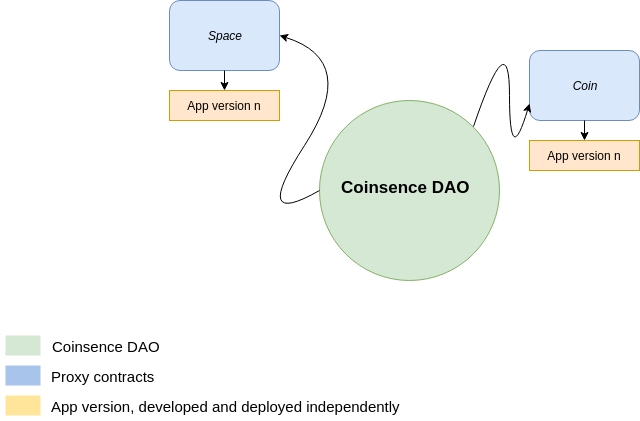

# coinsence-monorepo  [](https://travis-ci.org/Coinsence/coinsence-monorepo) [](https://coveralls.io/github/Coinsence/coinsence-monorepo?branch=master)
Coinsence project monorepo - includes our smart contracts

This repository contains the following apps:

- **[Space](apps/space)**: Deploy and manage coinsence spaces
- **[Coin](apps/coin)**: Deploy and manage coinsence coins
- **[Member](apps/member)**: Manage coinsence members accounts
- **[CoinsenceKit](apps/coinsence-kit)**: Deploy and manage coinsence DAO

## Local development chain

For local development it is recommended to use 
[ganache](http://truffleframework.com/ganache/) to run a local development 
chain. Using the ganache simulator no full Ethereum node is required.

We use the default aragon-cli devchain command to confgure and run a local 
development ganache.

    $ npm run devchain (or aragon devchain)

To clear/reset the chain use: 

    $ npm run devchain -- --reset (or aragon devchain --reset)

### Development Setup

Node.js LTS or greater required.

- Note: @aragon/cli and truffle npm deps are automatically installed when bootstrapping.

```bash
# Bootstrap project dependencies:
$ npm i

# Run an Ethereum node and ipfs
$ npm run devchain

# Deploy each app to the devchain
$ npm run deploy:apps

# Deploy a new CoinsenceKit and create a new DAO with the latest app versions
$ npm run deploy:kit
$ npm run deploy:dao

# Run all tests
$ npm run test

# Run single app tests
$ npm run test:space

# Run coverage
$ npm run coverage

# current app name aliases: {space, coin, member}
```

## Contracts architecture

Contracts are organized in independent apps (see `/apps`) and are developed 
and deployed independently. Each app has a version and can be "installed" 
on the Coinsence DAO independently.



A DAO can be deployed using the `apps/coinsence-kit/scripts/deploy-kit.js` script or with the 
`npm run deploy:dao` command. This deploys a new Kredits DAO, installs
the latest app versions and sets the required permissions.

See each app in `/apps/*` for details.

## Helper scripts

`scripts/` contains some helper scripts to interact with the contracts from the
CLI. _At some point these should be moved into a real nice CLI._

To run these scripts use `truffle exec`. For example: `truffle exec
scripts/add-proposal.js`.

### current-address.js

Prints all known DAO addresses and the DAO address for the current network

    $ truffle exec scripts/current-address.js
    or
    $ npm run dao:address

### deploy-kit.js

Deploys a new CoinsenceKit that allows to create a new DAO

    $ cd apps/coinsence-kit && truffle exec scripts/deploy-kit.js
    or
    $ npm run deploy:kit

`ENS` address is required as environment variable.  

### new-dao.js

Creates and configures a new DAO instance.

    $ cd apps/coinsence-kit && aragon contracts exec scripts/new-dao.js 
      Arguments:
        --spaceName     Space name
        --ipfs          IPFS hash for space description
        --coinName      Coin name
        --coinSymbol    Coin symbol         
        --coinDecimals  Coin decimals
        --root          Owner address
    or
    $ npm run deploy:dao

CoinsenceKit address is load from `lib/addresses/CoinsenceKit.json` or can be 
configured through the `COINSENCE_KIT` environment variable.

### deploy-apps.sh

Runs `npm install` for each app and publishes a new version.

    $ ./scripts/deploy-apps.sh
    or
    $ npm run deploy:apps

## Deployment

### Apps deployment

To deploy a new app version run:

    $ aragon apm publish major --environment=ENVIRONMENT_TO_DEPLOY

### CoinsenceKit

deploy the CoinsenceKit as Kit to create new DAOs

    $ aragon contracts exec apps/coinsence-kit/scripts/deploy-kit.js --environment=ENVIRONMENT_TO_DEPLOY

### Creating a new DAO

make sure all apps and the CoinsenceKit are deployed, then create a new DAO:

    $ aragon contracts exec apps/coinsence-kit/scripts/new-dao.js --environment=ENVIRONMENT_TO_DEPLOY
    --spaceName=SPACE_NAME --ipfs=IPFS_HASH --coinName=COIN_NAME --coinSymbol=COIN_SYMBOL --coinDecimals=COIN_DECIMALS --root=OWNER_ADDRESS

## ACL / Permissions

## Upgradeable contracts

We use aragonOS for upgradeablity of the different contracts.
Refer to the [aragonOS upgradeablity documentation](https://hack.aragon.org/docs/upgradeability-intro) 
for more details.

### Example

1. Setup (see ###Development Setup)
    1. Deploy each contract/apps (see `/apps/*`)
    2. Create a new DAO (see /apps/coinsence-kit/scripts/deploy-kit.js)
2. Update
    1. Deploy a new Version of the contract/app (see `/apps/*`)
    2. Use the `aragon dao upgrade` command to "install" the new version for the DAO
      (`aragon dao upgrade <DAO address> <app name>`)

## Issues

If you come across an issue with Coinsence apps, do a search in the [Issues](https://github.com/Coinsence/coinsence-monorepo/issues) tab of this repo to make sure it hasn't been reported before. Follow these steps to help us prevent duplicate issues and unnecessary notifications going to the many people watching this repo:

- If the issue you found has been reported and is still open, and the details match your issue, give a "thumbs up" to the relevant posts in the issue thread to signal that you have the same issue. No further action is required on your part.
- If the issue you found has been reported and is still open, but the issue is missing some details, you can add a comment to the issue thread describing the additional details.
- If the issue you found has been reported but has been closed, you can comment on the closed issue thread and ask to have the issue reopened because you are still experiencing the issue. Alternatively, you can open a new issue, reference the closed issue by number or link, and state that you are still experiencing the issue. Provide any additional details in your post so we can better understand the issue and how to fix it.
